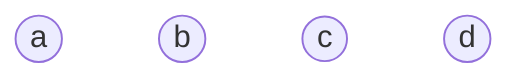
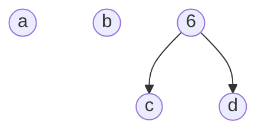
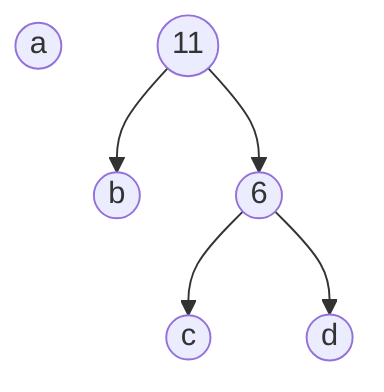
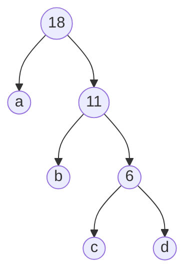

## 名词
1. 路径：在一棵树中，一个结点到另一个结点之间的通路，称为路径
2. 路径长度：在一条路径中，每经过一个结点，路径长度都要加 1 。例如在一棵树中，规定根结点所在层数为1层，那么从根结点到第 i 层结点的路径长度为 i - 1 。
3. 结点的权：给每一个结点赋予一个新的数值，被称为这个结点的权。
4. 结点的带权路径长度：指的是从根结点到该结点之间的路径长度与该结点的权的乘积
5. 树的带权路径长度：树中所有叶子结点的带权路径长度之和。通常记作 “WPL”

## 哈夫曼树，最优二叉树

当用 n 个结点（都做叶子结点且都有各自的权值）试图构建一棵树时，如果构建的这棵树的带权路径长度最小，称这棵树为“最优二叉树”，有时也叫“赫夫曼树”或者“哈夫曼树”。

构建哈夫曼树的过程
1. 在 n 个权值中选出两个最小的权值，对应的两个结点组成一个新的二叉树，且新二叉树的根结点的权值为左右孩子权值的和
2. 在原有的 n 个权值中删除那两个最小的权值，同时将新的权值加入到 n–2 个权值的行列中，以此类推
3. 重复 1 和 2 ，直到所以的结点构建成了一棵二叉树为止，这棵树就是哈夫曼树

图示，有a、b、c、d个节点，权值分别为7、5、2、4

合并 权值最小的c和d , 树根的权值为 2 + 4 = 6，同时将原有权值中的 2 和 4 删掉，将新的权值 6 加入.

合并 权值最小的b和6 , 树根的权值为 5 + 6 = 11，同时将原有权值中的 5 和 6 删掉，将新的权值 11 加入.

最后合并 a和 11

