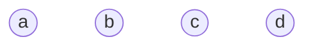
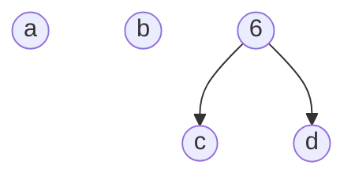
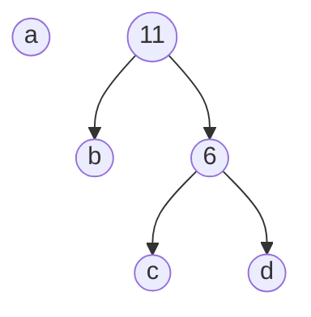
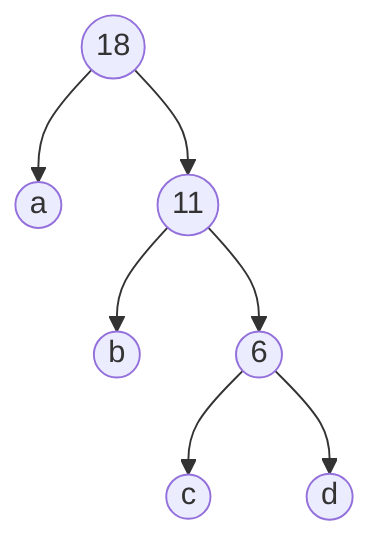

## 名词
1. 路径：在一棵树中，一个结点到另一个结点之间的通路，称为路径
2. 路径长度：在一条路径中，每经过一个结点，路径长度都要加 1 。例如在一棵树中，规定根结点所在层数为1层，那么从根结点到第 i 层结点的路径长度为 i - 1 。
3. 结点的权：给每一个结点赋予一个新的数值，被称为这个结点的权。
4. 结点的带权路径长度：指的是从根结点到该结点之间的路径长度与该结点的权的乘积
5. 树的带权路径长度：树中所有叶子结点的带权路径长度之和。通常记作 “WPL”

## 二叉树的遍历
有二叉树：
```c++
typedef struct BiTNode
{
	int data;
	struct BiTNode * lchild;
	struct BiTNode * rchild;
	
}BiTNode, *BiTree;
```
### 递归方式
1. 先序遍历：首先访问根节点，然后访问左子树，最后访问右子树
```c++
void PreOrder(BiTree root)
{
	if (root != nullptr)
	{
		printf("%d", root->data);
		PreOrder(root->lchild);
		PreOrder(root->rchild);
	}
}
```
2. 中序遍历：首先访问左子树，接着访问根结点，最后访问右子树
```c++
void InOrder(BiTree root)
{
	if (root != nullptr)
	{
		InOrder(root->lchild);
		printf("%d", root->data);
		InOrder(root->rchild);
	}
}
```
3. 后序遍历的方式是：首先访问左子树，接着访问右子树，最后访问根结点
```c++
void PostOrder(BiTree root)
{
	if (root != nullptr)
	{
		PostOrder(root->lchild);
		PostOrder(root->rchild);
		printf("%d", root->data);
	}
}
```
栈方式：

先序非递归算法
```c++
void PreOrderTraverse(BiTree root)
{
	std::stack<BiTree> stk;
	BiTree p = root;
	while (p != nullptr || !stk.empty())
	{
		if (p != nullptr)
		{
			printf("%c\n", p->data);
			if (p->rchild != nullptr)
			{
				stk.push(p->rchild);
			}

			p = p->lchild;
		}
		else
		{
			p = stk.top();
			stk.pop();
		}
	}
}
```
中序非递归算法
```c++
void InOrderTraverse(BiTree root)
{
	std::stack<BiTree> stk;
	BiTree p = root;
	while (p != nullptr || !stk.empty())
	{
		if (p != nullptr)
		{
			stk.push(p);
			p = p->lchild;
		}
		else
		{
			BiTree q = stk.top();
			stk.pop();
			printf("%d\n", q->data);
			p = q->rchild;
		}
	}
}
```


## 哈夫曼树，最优二叉树

当用 n 个结点（都做叶子结点且都有各自的权值）试图构建一棵树时，如果构建的这棵树的带权路径长度最小，称这棵树为“最优二叉树”，有时也叫“赫夫曼树”或者“哈夫曼树”。

构建哈夫曼树的过程
1. 在 n 个权值中选出两个最小的权值，对应的两个结点组成一个新的二叉树，且新二叉树的根结点的权值为左右孩子权值的和
2. 在原有的 n 个权值中删除那两个最小的权值，同时将新的权值加入到 n–2 个权值的行列中，以此类推
3. 重复 1 和 2 ，直到所以的结点构建成了一棵二叉树为止，这棵树就是哈夫曼树

图示，有a、b、c、d个节点，权值分别为7、5、2、4


合并 权值最小的c和d , 树根的权值为 2 + 4 = 6，同时将原有权值中的 2 和 4 删掉，将新的权值 6 加入.

合并 权值最小的b和6 , 树根的权值为 5 + 6 = 11，同时将原有权值中的 5 和 6 删掉，将新的权值 11 加入.

最后合并 a和 11

代码：
```c++
#define MAXLEAFNUM 50 //最多叶节点树
typedef struct
{
	char ch; //节点字符
	int weight;//结点权重
	int parent;//父节点下标
	int left;//左孩子下标
	int right;//右孩子下标
}HuffmanTree[2*MAXLEAFNUM];

typedef char* HuffmanCode[MAXLEAFNUM+1];

//数组c存放n个字符，数组w存放n个概率， n小于MAXLEAFNUM
void createHTree(HuffmanTree HT, char* c, int *w, int n)
{
	if (n<=1)
	{
		return ;
	}

	int i = 1;
	for (; i <=n; i++)
	{
		HT[i].ch = c[i - 1];
		HT[i].weight = w[i - 1];
		HT[i].parent = 0;
		HT[i].left = 0;
		HT[i].right = 0;
	}

	//初始化
	for(;i < 2*n; i++)
	{
		HT[i].parent = 0;
		HT[i].left = 0;
		HT[i].right = 0;
	}

	//构建哈夫曼树
	for (i = n + 1; i <= 2*n; i++)
	{
		int s1, s2;
		//选择最小两颗树
		Select(*HT, i - 1, &s1, &s2);
		HT[s1].parent = HT[s2].parent = i;
		HT[i].left = s1;
		HT[i].right = s2;
		HT[i].weight = HT[s1].weight + HT[s2].weight;
	}
}

void Select(HuffmanTree HT, int end, int *s1, int *s2)
{
	int min1, min2;
	//遍历数组初始下标为 1
	int i = 1;
	//找到还没构建树的结点
	while (HT[i].parent != 0 && i <= end)
	{
		i++;
	}
	min1 = HT[i].weight;
	*s1 = i;

	i++;
	while (HT[i].parent != 0 && i <= end)
	{
		i++;
	}
	//对找到的两个结点比较大小，min2为大的，min1为小的
	if (HT[i].weight < min1)
	{
		min2 = min1;
		*s2 = *s1;
		min1 = HT[i].weight;
		*s1 = i;
	}
	else
	{
		min2 = HT[i].weight;
		*s2 = i;
	}
	//两个结点和后续的所有未构建成树的结点做比较
	for (int j = i + 1; j <= end; j++)
	{
		//如果有父结点，直接跳过，进行下一个
		if (HT[j].parent != 0)
		{
			continue;
		}
		//如果比最小的还小，将min2=min1，min1赋值新的结点的下标
		if (HT[j].weight < min1)
		{
			min2 = min1;
			min1 = HT[j].weight;
			*s2 = *s1;
			*s1 = j;
		}
		//如果介于两者之间，min2赋值为新的结点的位置下标
		else if (HT[j].weight >= min1 && HT[j].weight < min2)
		{
			min2 = HT[j].weight;
			*s2 = j;
		}
	}
}
```
哈夫曼编码:
从叶子节点开始出发朔源到根
```c++
// p为节点数组的指针，codes为string数组的指针, 用于存储每个节点的哈夫曼码
void HuffmanCode(HuffmanTree *p, const int numLeafs, string *codes)
{
	int parent;
	// 每次对一个叶子节点进行编码
	// i表示当前叶子节点位置
	for (int i = 0; i < numLeafs; i++)
	{
		// j表示当前节点位置，i是不能在下面循环中改变的
		// 使用j来记录节点的移动过程
		int j = i;

		// 当前节点的父节点位置
		parent = p[i].parent;

		// 从当前叶子节点p[i]开始，找到哈夫曼树的根节点
		// 循环结束条件是此时parent为0，即达到哈夫曼树的根节点
		while (parent != -1)
		{
			
			if (p[parent].left == j)
			{
				codes[i].push_back('0'); // 如果当前节点是父节点的左子树，则此分支编码为0
			}
			else
			{
				codes[i].push_back('1'); // 如果当前节点是父节点的右子树，则编码为1
			}

			j = parent;
			parent = p[j].parent;
		}
		cout << codes[i] << endl;
	}
}
```

解码
```c++
void HuffmanDecoding(HuffmanTree HT, int n, char* buf)
{
	int p = 2*n -1; //根
	while(*buf)
	{
		if (*buf == '0')
		{
			p = HT[p].left;
		}
		else
		{
			p = HT[p].right;
		}

		if (HT[p].left == 0 && HT[p].right == 0)
		{
			printf("%c", HT[p].ch)
			p = 2*n - 1; //回到根
		}
	}
}
```
# 线索二叉树
二叉树是一个非线性表， 二叉树的遍历，实质上就是对非线性结构的线性化过程，它使每一个节点的都有一个直接前趋和直接后继。
在二叉树的链表存储结构中只能找到一个节点的左右子节点，不能直接得到在任一遍历中的直接前趋和直接后继，线索二叉树就是为了保存这些信息的。

## 线索二叉树的节点
为了保存任意序列中前趋节点和后继节点的信息，可以在每个节点中增加指针存放前趋节点和后趋节点，但是这样存储空间利用率低。</br>
若有n个节点组成的二叉树用二叉链表存储时一定会有n+1的空指针，可以利用这些指针存放节点的前趋和后继信息，为此需要在节点中增加ltag和rtag，用于区分子节点指针的指向：


||||||
|:-:|:-:|:-:|:-:|:-:|
| ltag|lchild|data|rchild|rtag|

若ltag = 0，lchild表示左子节点，反之表示直接前趋
若rtag = 0，rchild表示右子节点，反之表示直接后趋

以上存储结构成为线索链表，将二叉树以某种次序遍历改为线索二叉树的过程叫做线索化。