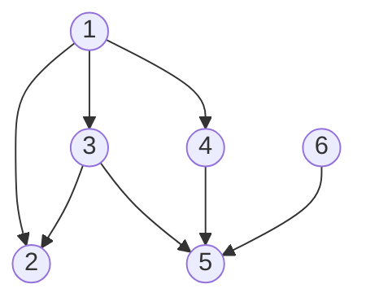
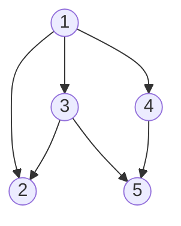
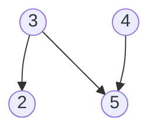
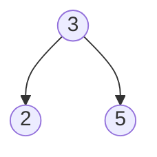
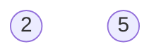
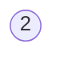

# 图的概念

# 图的存储结构
邻接矩阵和邻接链表

# 图的遍历
深度优先搜索（Depth First Search, DFS）
广度优先搜索（Breadth First Search, BFS）

# 生成树及最小生成树

# 拓扑排序
## AOV网
在现代化管理中，人们常用有向图来描述和分析一项工程的计划和实施过程，一个工程常被分为多个小的子工程，这些子工程被称为活动（Activity)，在带权有向图中若以顶点表示事件，有向边表示活动，边上的权值表示该活动持续的时间，这样的图简称为AOE网。

AOV网不应该存在有向环，若存在则意味着某项活动必须以自身完成为先决条件

## 拓扑排序
拓扑排序就是将AOV网中所有顶点排成一个线性序列的过程，该序列满足vi到vj有条路径，在该序列中vi在vj之前。

拓扑排序过程：
- 在AOV网中选择一个入度为0的顶点且输出它
- 从网中删除该顶点及相关的弧
- 重复上面两步，直到不存在入度为0为止

执行完成后有2中情况：
1. 所有点都已输出，此时拓扑排序完成，说明网中不存在回路
2. 尚有未输出的点，且都有前趋节点，说明存在回路

例如：

第一步：删除入度为0 的6节点，

第二步：删除入度为0的1节点，

第三步：删除入度为0的4节点，

第四步：删除入度为0的3节点，

第五步：删除入度为0的5节点，

最后：删除入度为0的2节点，所以拓扑排序为：6，1，4，3，5，2

## AOE 网

与AOV网相比，AOE的边带有权值

在AOE网中至少有一个入度为0顶点称为**源点**，应该有一个出度为0的结束点，称为**汇点**

从源点到汇点的路径中，长度最长的为关键。关键路径上所有活动均是关键活动